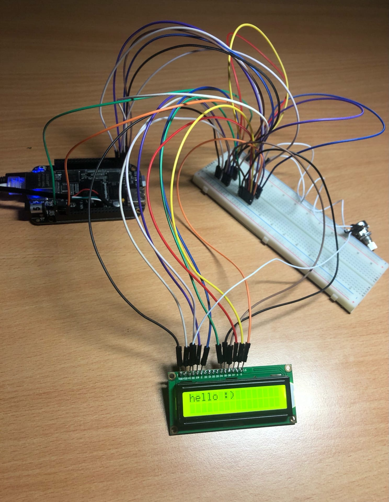

# bbb_lcd
LCD platform driver for beaglebone black

Driver exports sysfs interface to `/sys/class/lcd/lcd16x2`

For example:

```sh
/sys/class/lcd/lcd16x2 # echo 'clear' > lcdcmd
```

```sh
/sys/class/lcd/lcd16x2 # echo 'hello :)' > lcdtext
```

